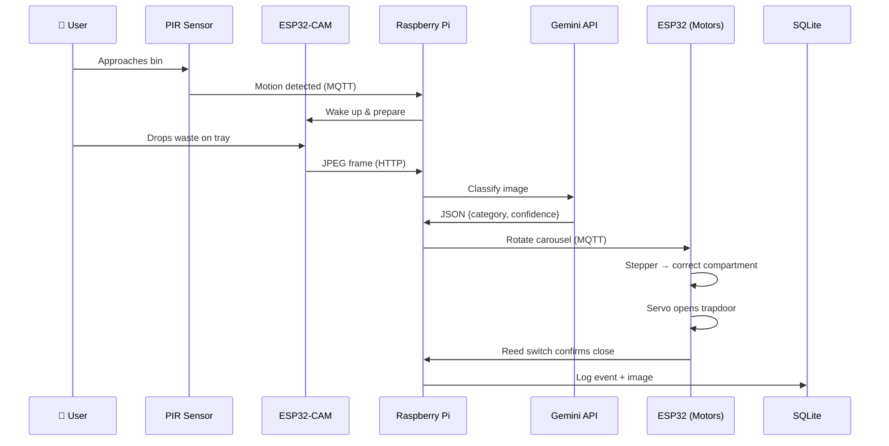

<p align="center">
  
</p>

<h1 align="center">♻️ ECOBIN — Smart Waste Sorting Bin</h1>

<p align="center">
  <strong>AI-powered waste classification and automatic sorting using computer vision</strong>
</p>

<p align="center">
  <a href="#-about"></a>
  <a href="#-tech-stack"></a>
  <a href="#-tech-stack"></a>
  <a href="LICENSE"></a>
</p>

<p align="center">
  <a href="#-about">About</a> •
  <a href="#-architecture">Architecture</a> •
  <a href="#-features">Features</a> •
  <a href="#-tech-stack">Tech Stack</a> •
  <a href="#-getting-started">Getting Started</a> •
  <a href="#-project-structure">Project Structure</a> •
  <a href="#-license">License</a>
</p>

---

## 🇵🇹 Sobre

> **Projeto académico** para a unidade curricular **Laboratório IoT** — Universidade do Algarve (UAlg), Licenciatura em Engenharia de Sistemas e Tecnologias de Informação (LESTI).

O **ECOBIN** é um contentor de lixo inteligente que classifica resíduos automaticamente usando visão computacional e IA (Google Gemini 2.0 Flash). O sistema captura uma imagem do resíduo depositado, classifica-o em 4 categorias, e aciona um carrossel mecânico rotativo para depositar o lixo no compartimento correto — tudo de forma autónoma.

---

## 🌍 About

**ECOBIN** is an AI-powered smart waste bin that automatically classifies and sorts waste using computer vision. When a user drops waste into the bin, an ESP32-CAM captures an image, a Raspberry Pi sends it to the Google Gemini 2.0 Flash API for classification, and a motorized carousel rotates to deposit the waste into the correct compartment — all autonomously.

### Key Highlights
- 🤖 **Real-time AI classification** using Google Gemini 2.0 Flash
- 🔄 **4-compartment motorized carousel** with stepper motor
- 📡 **Distributed IoT architecture** with 4 hardware nodes via MQTT
- 📊 **Live web dashboard** with classification history and fill levels
- 🔌 **Offline resilience** — basic operation continues without internet
- 🖨️ **3D-printed enclosure** — custom cylindrical design

---

## 🏗️ Architecture

The ECOBIN uses a **distributed architecture** with 4 hardware nodes communicating via **Wi-Fi + MQTT**:

```
┌─────────────────────────────────────────────────────────────┐
│                    Wi-Fi Network (MQTT)                      │
├─────────────┬──────────────┬──────────────┬─────────────────┤
│             │              │              │                 │
│  📷 Vision  │ ⚙️ Container │ 🖥️ Interface │ 🧠 Gateway      │
│  ESP32-CAM  │ ESP32-WROOM  │ Arduino R4   │ Raspberry Pi    │
│             │              │   WiFi       │                 │
│ • Camera    │ • Stepper    │ • OLED       │ • MQTT Broker   │
│   OV2640    │   motor      │   display    │ • Gemini API    │
│ • HTTP      │ • Servo      │ • NeoPixel   │ • SQLite DB     │
│   endpoint  │ • Reed SW    │ • PIR sensor │ • Web Dashboard │
│             │ • Ultrasonic │ • Buzzer     │ • REST API      │
└─────────────┴──────────────┴──────────────┴─────────────────┘
```

### Operation Flow



---

## ✨ Features

| Feature | Description |
|---------|------------|
| 🤖 AI Classification | Real-time waste classification via Gemini 2.0 Flash |
| 🔄 Auto-Sorting | 4-compartment carousel with stepper motor (90° increments) |
| 📷 Vision System | ESP32-CAM with OV2640 for waste imaging |
| 💡 Visual Feedback | NeoPixel LED ring — color-coded by waste category |
| 🔊 Audio Feedback | Buzzer for accept/reject confirmation |
| 📊 Web Dashboard | Real-time fill levels, classification history with images |
| 🌙 Night Mode | LDR-based ambient light detection |
| 📡 MQTT Communication | Decoupled, event-driven architecture |
| 💾 Event Logging | SQLite database with full history and timestamps |
| 🔌 Offline Mode | Core functionality works without internet |
| 🖨️ 3D Printed | Custom cylindrical enclosure in PLA |

---

## 🛠️ Tech Stack

| Layer | Technology |
|-------|-----------|
| **AI / Classification** | Google Gemini 2.0 Flash API |
| **Communication** | MQTT (Mosquitto broker) |
| **Database** | SQLite |
| **Backend** | Python 3 (Flask/FastAPI) |
| **Dashboard** | HTML / CSS / JS (WebSocket) |
| **Firmware** | Arduino IDE / PlatformIO (C/C++) |
| **3D Printing** | PLA filament, custom design |
| **Gateway OS** | Raspberry Pi OS |

---

## 🚀 Getting Started

### Prerequisites

- Raspberry Pi 4 (2GB+) with Raspberry Pi OS
- ESP32-CAM (OV2640)
- ESP32-WROOM-32UE
- Arduino UNO R4 WiFi
- Python 3.9+
- Arduino IDE or PlatformIO
- Google Gemini API key

### Installation

```bash
# Clone the repository
git clone https://github.com/<YOUR_USERNAME>/ecobin.git
cd ecobin

# Set up the gateway (Raspberry Pi)
cd gateway
python -m venv venv
source venv/bin/activate
pip install -r requirements.txt

# Configure environment variables
cp .env.example .env
# Edit .env with your Gemini API key and MQTT settings

# Start the system
python main.py
```

### Firmware Upload

```bash
# ESP32-CAM (Vision Node)
cd firmware/esp32_cam
# Open in Arduino IDE → Select board → Upload

# ESP32-WROOM (Container Node)  
cd firmware/esp32_contentor
# Open in Arduino IDE → Select board → Upload

# Arduino R4 WiFi (Interface Node)
cd firmware/arduino_interface
# Open in Arduino IDE → Select board → Upload
```

---

## 📁 Project Structure

```
ecobin/
├── 📄 README.md
├── 📄 CLAUDE.md                  # AI assistant context
├── 📄 LICENSE
├── 📄 .gitignore
│
├── 📂 firmware/                  # Microcontroller code
│   ├── 📂 esp32_cam/             # Vision Node (ESP32-CAM)
│   │   └── esp32_cam.ino
│   ├── 📂 esp32_contentor/       # Container Node (ESP32-WROOM)
│   │   └── esp32_contentor.ino
│   └── 📂 arduino_interface/     # Interface Node (Arduino R4)
│       └── arduino_interface.ino
│
├── 📂 gateway/                   # Raspberry Pi software
│   ├── 📄 main.py                # Entry point
│   ├── 📄 requirements.txt
│   ├── 📄 .env.example
│   ├── 📂 classifier/            # Gemini AI pipeline
│   ├── 📂 mqtt/                  # MQTT client & handlers
│   ├── 📂 database/              # SQLite schema & queries
│   └── 📂 web/                   # Dashboard (REST + WebSocket)
│
├── 📂 3d_models/                 # 3D printing files
│   ├── 📂 stl/                   # Print-ready STL files
│   └── 📂 source/                # Editable design files
│
├── 📂 docs/                      # Documentation
│   ├── 📂 assets/                # Images, diagrams
│   ├── 📂 wiring/                # Wiring diagrams
│   └── 📄 api.md                 # API documentation
│
├── 📂 .github/                   # GitHub automation
│   ├── 📂 workflows/             # CI/CD pipelines
│   ├── 📂 ISSUE_TEMPLATE/        # Issue templates
│   └── 📄 PULL_REQUEST_TEMPLATE.md
│
└── 📂 tests/                     # Test files
```

---

## 📋 Roadmap

- [x] Project proposal approved
- [x] Bill of materials defined
- [ ] Hardware assembly & wiring
- [ ] ESP32-CAM firmware (Vision Node)
- [ ] ESP32-WROOM firmware (Container Node)
- [ ] Arduino R4 firmware (Interface Node)
- [ ] Raspberry Pi gateway software
- [ ] Gemini AI classification pipeline
- [ ] MQTT communication layer
- [ ] SQLite database & event logging
- [ ] Web dashboard (real-time)
- [ ] 3D printed enclosure
- [ ] System integration & testing
- [ ] Documentation & demo video

---

## 🤝 Contributing

This is an academic project, but suggestions and feedback are welcome! Feel free to open an issue or submit a pull request.

---

## 📄 License

This project is licensed under the MIT License — see the [LICENSE](LICENSE) file for details.

---

## 👤 Author

**Alexandru Tutunaru**  
🎓 LESTI — Universidade do Algarve (UAlg)  
📧 [Your Email]  
🔗 [Your LinkedIn]  
🐙 [GitHub](https://github.com/DevPool1)

---

<p align="center">
  <sub>Built with ❤️ for Laboratório IoT @ UAlg</sub>
</p>
